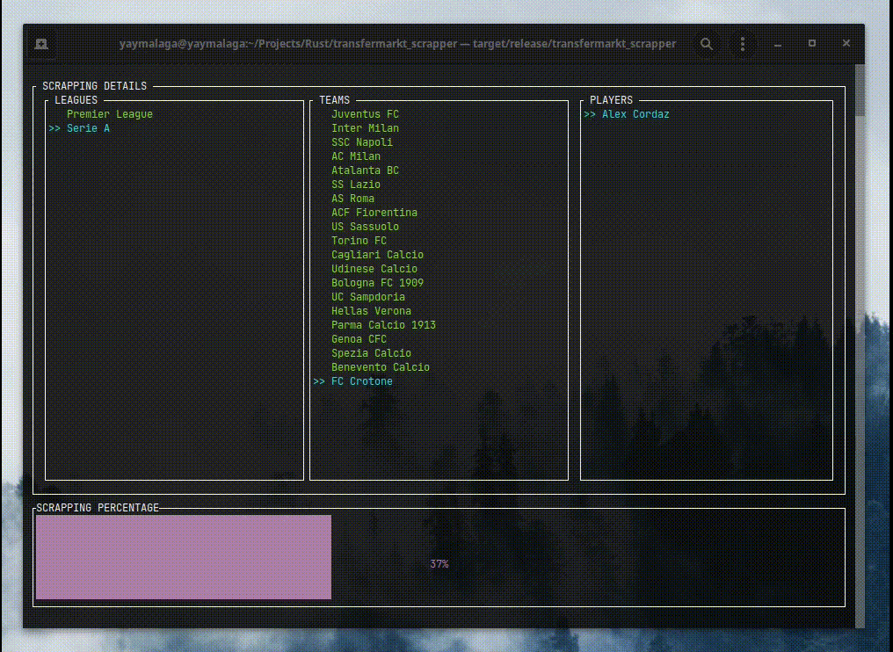

# Transfermark Scrapper

This toy project is a re-implementation of my previous scrapper in Python using Selenium. The main goal was to analyze the experience of using Rust for high-level tasks such as webscrapping. 

## Development experience

The development using Rust was wonderful and the compiler really helps you to catch a lot of errors and to properly think the whole architecture. As always, this is a double-edged sword because of the extra time you spend writing the tool. However, I really believe it is worth it.

The ideal workflow for me was using an interactive Python terminal for creating the xPath locators and then use this knowledge for building the proper app.

## Goal

The result is a huge JSON file with the following schema, including information about each item, such as pictures, prices, etc. The leagues can be whitelisted in [src/main.rs](src/main.rs)

- LEAGUE_1
  - TEAM_1
    - PLAYER_1
    - PLAYER_2
    - ...
  - TEAM_2
  - ...
- LEAGUE_2
  - TEAM_1
    - PLAYER_1
    - ...
  - ...
- ...

## Result

As an extra cool feature, I also implemented a TUI so you can visually follow the progress. Here you can see the application running:



## Dependencies

Cargo will install all the neccessary dependencies on build. 

The only external dependency is the chromedriver, which must be download and executed before running this tool:

```bash
./chromedriver --port=4444
```